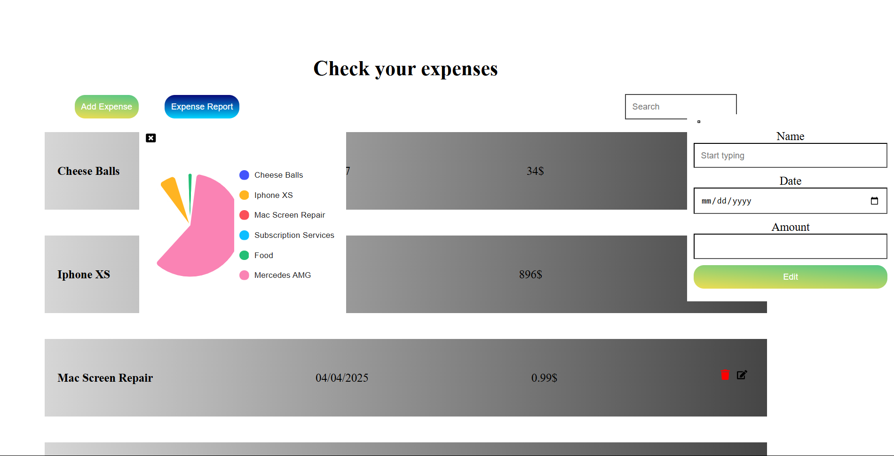

# 💸 Expense Tracker App

A modern and intuitive expense tracking web application built with React and Node.js. Track your daily spending, visualize data through pie charts, and stay alerted via email notifications when your expenses go over the limit.

---



## ✨ Features

- 🧾 Add, edit, and delete expenses
- 📅 Filter/search by date, name, or amount
- 📊 Visualize spending with a pie chart report
- 📬 Email alerts when total expenses exceed $10,000
- ☁️ Backend with Node.js + MongoDB
- 🎯 Clean UI with Tailwind CSS and React Icons

---

## 🧠 Background Services

A background job runs periodically on the backend to monitor total user expenses. If the threshold of **$10,000** is exceeded, an automatic **email notification** is sent using **Nodemailer** or your configured mail service.

---

## 🛠️ Tech Stack

| Frontend | Backend | Database | Other |
|---------|---------|----------|-------|
| React + Vite | Node.js + Express | MongoDB + Mongoose | Tailwind CSS, Nodemailer, React Icons, MUI Charts |

---

## 🚀 Getting Started

### 1. Clone the repo

```bash
git clone https://github.com/GideaAndrei43/ExpenseTracker-Backend-App.git
cd expense-tracker
